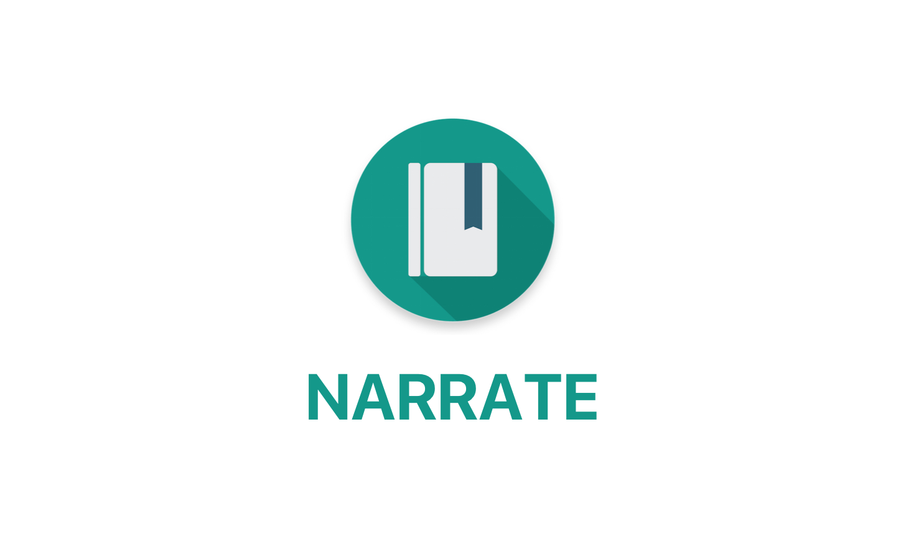

Narrate is a beautiful journal created to give you the ability to record your thoughts, experiences, and ideas. With the ability to sync your journal across all of your devices, you won't have ever be without your journal. With a minimalist, material user interface, Narrate has a stunning user experience that is unmatched in this category. Click [here](https://play.google.com/store/apps/details?id=com.datonicgroup.narrate.app) to download Narrate from the Google Play Store.

<h2>Install</h2>
Narrate is available for download on [Google Play](https://play.google.com/store/apps/details?id=com.datonicgroup.narrate.app). If you would like to manually build and install Narrate on your Android device, Narrate depends on APIs from [Parse](http://parse.com) and [Dropbox](https://dropbox.com) so you will need to register a new application on your own with each service.

To manually build and install Narrate:

1. Create a gradle.properties file in the root directory (see gradle.properties.example).
2. Create a keystore.properties file in the root directory (see keystory.properties.example).
3. Create a local.properties file in the root directory (see local.properties.example).

<h2>Bugs & Feature Requests</h2>
Please use GitHub's issue tracker for all bugs and feature requests. Please search through all of the issues before creating a new issue.

<h2>Support</h2>
Please refer to the wiki for any support-related questions.

<h2>Contribution Guidelines</h2>
Public contributions are welcomed in the form of pull requests with a clear description of your changes and if they relate to any open issues.